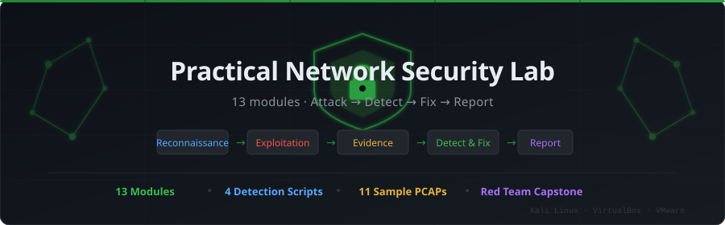

<div align="center">



<br/>


<br/>

**A hands-on network security lab — 13 modules covering reconnaissance, exploitation, detection, hardening, and red-team reporting. Built for isolated VMs you own and control.**

<br/>

[Get Started](#-quick-start) · [Modules](#-module-roadmap) · [Scripts](scripts/) · [Sample PCAPs](samples/) · [Cheat Sheet](CHEAT_SHEET.md) · [Capstone](13_redteam_capstone/)

</div>

---

## What is this?

This is a complete, practical network security course built around one workflow:

```
Reconnaissance → Exploitation → Evidence Capture → Detection → Fix → Report
```

Every module teaches both sides — how an attack works and exactly what evidence it leaves behind for a defender. You don't just run commands; you explain what each one proves, capture the output as evidence, identify the defensive signal, and document a finding.

The goal is to move from command execution to operational security judgment.

---

## ⚡ Quick Start

**1. Set up your isolated VM lab:**

```bash
# Kali (attacker)   → 192.168.56.10
# Target VM         → 192.168.56.20
# Server / DNS/DHCP → 192.168.56.30
# Router VM         → 192.168.56.1
```

See [LAB_RANGE_SETUP.md](LAB_RANGE_SETUP.md) for the full VirtualBox/VMware setup.

**2. Install dependencies on Kali:**

```bash
sudo apt update && sudo apt install -y nmap tcpdump wireshark curl dnsutils \
  net-tools traceroute openssl python3 python3-pip
pip install scapy
```

**3. Verify connectivity:**

```bash
ping -c 3 192.168.56.20
nmap -sn 192.168.56.0/24
```

**4. Start at Module 1 and work forward. Do not skip modules.**

---

## 🗺 Module Roadmap

| # | Module | Topics | Difficulty |
|---|---|---|---|
| 01 | [Foundations](01_foundations/README.md) | Recon, asset inventory, attack surface | Beginner |
| 02 | [Networking](02_networking/README.md) | Packets, ARP, TCP/UDP, DNS, subnetting | Beginner |
| 03 | [Denial of Service](03_dos/README.md) | Resource exhaustion, SYN floods, detection | Beginner |
| 04 | [Filters & ACLs](04_filters/README.md) | MAC filtering, whitelist/blacklist bypass | Intermediate |
| 05 | [MITM](05_mitm/README.md) | ARP poisoning, traffic relay, intercept | Intermediate |
| 06 | [DNS Attacks](06_dns/README.md) | Spoofing, cache abuse, DNSSEC | Intermediate |
| 07 | [Protocol Vulnerabilities](07_protocols/README.md) | Telnet, FTP, SMB, SNMP, TLS auditing | Intermediate |
| 08 | [DHCP Attacks](08_dhcp/README.md) | Rogue server, starvation, DHCP snooping | Intermediate |
| 09 | [Router Attacks](09_router/README.md) | Management-plane abuse, firmware, hardening | Advanced |
| 10 | [Weak Cryptography](10_crypto/README.md) | Hash failures, weak TLS, password hashing | Advanced |
| 11 | [Web Exploitation](11_web_exploitation/README.md) | SQLi, command injection, path traversal | Advanced |
| 12 | [Defense](12_defense/README.md) | Firewalls, IDS, log analysis, hardening | Advanced |
| 13 | [Red Team Capstone](13_redteam_capstone/README.md) | Full attack chain, reporting | Capstone |

**Learning track:**

```
Beginner (01–03) → Intermediate (04–08) → Advanced (09–12) → Capstone (13)
```

---

## 🛠 Detection Scripts

Four production-quality Python 3 tools in [`scripts/`](scripts/):

| Script | What it detects |
|---|---|
| [`arp_monitor.py`](scripts/arp_monitor.py) | Live ARP binding changes — primary ARP spoofing indicator |
| [`ssh_bruteforce_detect.py`](scripts/ssh_bruteforce_detect.py) | SSH brute-force + compromise detection from auth.log |
| [`dns_anomaly.py`](scripts/dns_anomaly.py) | DNS mismatches, rogue resolvers, high NXDOMAIN rate |
| [`pcap_summary.py`](scripts/pcap_summary.py) | Full pcap analysis — protocols, top talkers, ARP table, HTTP, TLS SNI |

```bash
# Run ARP monitor before any MITM exercise
sudo python3 scripts/arp_monitor.py --iface eth0

# Analyse a capture
python3 scripts/pcap_summary.py samples/05_icmp_echo_sample.pcap

# Detect SSH brute force in auth.log
python3 scripts/ssh_bruteforce_detect.py --log /var/log/auth.log --threshold 5
```

---

## 📦 Sample PCAPs

Eleven synthetic captures in [`samples/`](samples/) for practice and tool testing:

| File | Protocol | What you'll see |
|---|---|---|
| `01_arp_traffic_sample.pcap` | ARP | Who-has requests, is-at replies, gratuitous ARP |
| `02_dns_lookup_sample.pcap` | DNS | A/MX/NS queries, iterative resolution, TTLs |
| `03_tcp_handshake_sample.pcap` | TCP | SYN → SYN/ACK → ACK, data exchange, FIN |
| `04_udp_query_sample.pcap` | UDP | Connectionless query/response pairs |
| `05_icmp_echo_sample.pcap` | ICMP | Ping request/reply, TTL decrements |
| `06_http_get_sample.pcap` | HTTP | GET request, headers, 200 response, cleartext body |
| `07_tls_client_hello_sample.pcap` | TLS | ClientHello, SNI, cipher suites |
| `08_broadcast_traffic_sample.pcap` | L2/L3 | Broadcast/multicast, discovery protocols |
| `09_smtp_activity_sample.pcap` | SMTP | EHLO, MAIL FROM, DATA, cleartext credentials |
| `10_port_scan_sample.pcap` | TCP | RST responses, closed/filtered port patterns |
| `11_rogue_dns_response_sample.pcap` | DNS | Competing DNS answers, transaction ID races |

```bash
# Open any pcap without Wireshark
tcpdump -nn -r samples/01_arp_traffic_sample.pcap

# Run the summary tool against any sample
python3 scripts/pcap_summary.py samples/02_dns_lookup_sample.pcap
```

---

## 📋 Lab Workflow — Every Module

```
1. Baseline  → record current state before anything changes
2. Execute   → run the controlled lab exercise
3. Capture   → tcpdump -w evidence.pcap during the exercise
4. Inspect   → read logs and pcap, identify indicators
5. Explain   → state the root cause in one sentence
6. Defend    → implement the control that closes the gap
7. Retest    → confirm the control works
8. Report    → fill in the REPORT_TEMPLATE.md
```

No step can be skipped. A lab without evidence is not complete.

---

## 📁 Course Pack

| File | Purpose |
|---|---|
| [CHEAT_SHEET.md](CHEAT_SHEET.md) | Offensive + defensive command reference, side-by-side |
| [MASTER_WORKBOOK.md](MASTER_WORKBOOK.md) | Evidence capture workbook for all 13 modules |
| [REPORT_TEMPLATE.md](REPORT_TEMPLATE.md) | Professional pentest/red-team report format |
| [CAPSTONE_RUBRIC.md](CAPSTONE_RUBRIC.md) | Scoring criteria for the final capstone |
| [PROGRESSION.md](PROGRESSION.md) | Phase-by-phase skill progression guide |
| [LAB_RANGE_SETUP.md](LAB_RANGE_SETUP.md) | Full VM setup and network configuration |

---

## 🧠 What makes this different

Most security courses teach you to copy commands. This course teaches you to reason:

- **What is reachable?** — Attack surface enumeration
- **What is trusted?** — Trust boundary analysis  
- **What does this command prove?** — Evidence discipline
- **What does the defender see?** — Blue-team perspective
- **What control closes the gap?** — Remediation validation

Every module has three files: `README.md` (theory + workflow), `commands.md` (command reference), `attack_analysis.md` (offensive reasoning + defensive indicators).

---

## ✅ Pass / Fail Criteria

A module **passes** when you can:
- State the objective and risk clearly
- Show the attack path with controlled, lab-safe commands
- Explain what each command proves
- Capture evidence that supports the finding
- Identify the defensive detection signal
- Validate the result after mitigation

A module **fails** if you only ran commands without explaining the path, impact, and evidence.

---

## ⚠️ Safety

Every exercise runs **only** in an isolated VM lab that you own and control.

- Use **Host-Only** or **Internal** network mode in VirtualBox/VMware
- Never bridge attack exercises to your home, college, or work network
- Never run these commands against systems you don't have explicit permission to test
- Take VM snapshots before every exercise

---

## 🤝 Contributing

See [CONTRIBUTING.md](CONTRIBUTING.md) — bug reports, module improvements, and new detection scripts are all welcome.

---

## 📄 License

MIT — see [LICENSE](LICENSE)

---

<div align="center">

**If this helped you learn, leave a ⭐ — it helps others find the course.**

</div>
