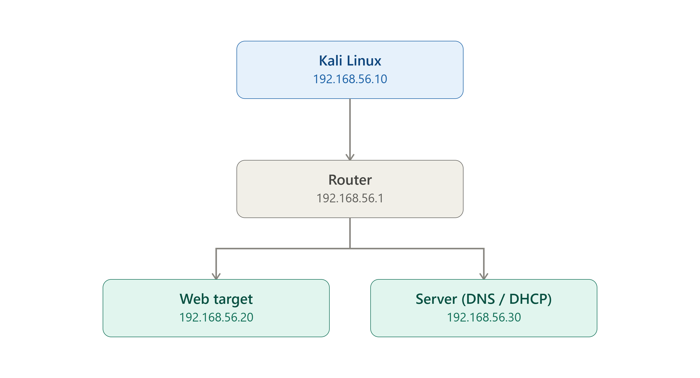

<div align="center">

# 🛡️ Practical Network Security Lab

### Learn the attack path. Validate the risk. Defend the system.

A hands-on, VM-based network security range — 13 modules covering
reconnaissance, MITM, DNS/DHCP abuse, router exploitation, cryptographic
trust failures, web exploitation, and defense — built around a real
attack → detect → fix workflow and finishing in a full red-team capstone.

[](https://github.com/imranshaikh116/Practical-Network-Security-Lab/blob/main/LICENSE)


**[Module Roadmap](#module-roadmap)** · **[Lab Setup](LAB_RANGE_SETUP.md)** · **[Cheat Sheet](CHEAT_SHEET.md)** · **[Report a Bug](../../issues)**

</div>

<p align="center">
  
</p>

---
# Practical-Network-Security-Lab
"Practical network security training lab for reconnaissance, exploitation, detection, hardening, and red-team reporting."
# Network Security VM Range — Offensive, Defensive, and Red-Team Lab

<div align="center">

## Course Hero

### Learn the attack path. Validate the risk. Defend the system.

A hands-on security lab focused on real network attack paths, evidence capture, defensive detection, and professional reporting.

</div>

This course is built for hands-on security learning in a controlled lab environment. It is designed to teach not just command execution, but the reasoning behind each action: what is exposed, what is trusted, how an attacker tests assumptions, and how defenders detect, contain, and remediate the same activity.

The goal is simple: learn to think like an attacker, validate like a pentester, and respond like a defender or SOC analyst.

## Course purpose

By the end of this range, a student should be able to:

- perform structured reconnaissance and service profiling
- understand the trust boundaries inside a small internal network
- explain what each command proves and what it does not prove
- validate attack paths against a lab-safe environment
- capture evidence that is strong enough for reporting and investigation
- connect offensive tactics to defensive detection and mitigation
- complete a realistic red-team capstone with professional-quality documentation

## Lab philosophy

This is not a theory-only course. Every module follows a real-world workflow used in penetration testing, adversary simulation, and defensive analysis:

```text
Define scope and boundaries
 ↓
Baseline the environment and identify assets
 ↓
Profile services, ports, and trust assumptions
 ↓
Form a hypothesis about weakness or abuse
 ↓
Validate the issue with controlled commands
 ↓
Escalate only when justified by evidence
 ↓
Capture logs, output, and forensic proof
 ↓
Assess defensive detection and response
 ↓
Recommend remediation and retest the control
 ↓
Document findings with clear impact and risk
```

The course is intentionally built around critical questions that matter in real operations:

- What is reachable?
- What is trusted?
- What service is exposing risk?
- What command proves the issue?
- What logs or artifacts show the activity?
- What should defenders look for?
- What control actually closes the gap?
- When should the attack stop and be documented instead of pushed further?

## What makes this course different

This lab emphasizes both sides of the security equation:

- Offensive flow: reconnaissance, exploitation logic, privilege access, lateral movement, and reporting
- Defensive flow: detection engineering, control validation, hardening, log review, and retest
- Red-team mindset: structured reasoning, decision points, evidence capture, and risk communication
- Professional workflow: every activity is documented like a real engagement rather than a random command dump

## Prerequisites

Students should be comfortable with:

- Linux command-line basics
- IP addressing, routing, and subnetting
- port/service fundamentals
- common protocols such as ARP, DNS, DHCP, HTTP, and TLS
- reading packet captures and system logs
- basic security concepts like trust boundaries and access control

## Beginner-to-advanced learning track

```text
Beginner foundation
┌──────────────────────────────────────────────┐
│ Modules 1–3                                  │
│ • basics of lab flow and reconnaissance      │
│ • service discovery and network fundamentals  │
│ • initial attack and defense reasoning        │
└──────────────────────────────────────────────┘

Intermediate operations
┌──────────────────────────────────────────────┐
│ Modules 4–8                                  │
│ • filtering, MITM, DNS, protocols, and DHCP │
│ • trust abuse and traffic manipulation       │
│ • evidence and defensive interpretation      │
└──────────────────────────────────────────────┘

Advanced exploitation and defense
┌──────────────────────────────────────────────┐
│ Modules 9–12                                 │
│ • router abuse, cryptographic trust failures │
│ • web exploitation and defensive controls   │
│ • detection logic, hardening, and retesting │
└──────────────────────────────────────────────┘

Capstone execution
┌──────────────────────────────────────────────┐
│ Module 13                                    │
│ • full attack chain and red-team workflow    │
│ • final evidence, remediation, and reporting │
└──────────────────────────────────────────────┘
```

## Recommended lab layout

```text
Kali                192.168.56.10
Router              192.168.56.1
Web target          192.168.56.20
Server / DNS / DHCP 192.168.56.30
```

The lab is intended to run in an isolated internal network. Do not expose it beyond your controlled environment.

## Suggested targets

This range works well with:

- Metasploitable 2
- DVWA
- OWASP Juice Shop
- WebGoat
- OpenWrt or another vulnerable router appliance

## Module roadmap

1. [01_foundations/README.md](01_foundations/README.md) — lab principles, reconnaissance basics, and baseline work
2. [02_networking/README.md](02_networking/README.md) — packet analysis, traffic understanding, and network trust
3. [03_dos/README.md](03_dos/README.md) — resource exhaustion and service disruption fundamentals
4. [04_filters/README.md](04_filters/README.md) — filtering, ACL logic, and traffic control abuse
5. [05_mitm/README.md](05_mitm/README.md) — ARP poisoning and intercept-based attacks
6. [06_dns/README.md](06_dns/README.md) — spoofing, abuse of name resolution, and trust issues
7. [07_protocols/README.md](07_protocols/README.md) — protocol misuse and service validation
8. [08_dhcp/README.md](08_dhcp/README.md) — rogue service manipulation and layer-2 trust abuse
9. [09_router/README.md](09_router/README.md) — management-plane weakness and router exploitation
10. [10_crypto/README.md](10_crypto/README.md) — credential, key, and cryptographic trust failures
11. [11_web_exploitation/README.md](11_web_exploitation/README.md) — web abuse, request manipulation, and application risk
12. [12_defense/README.md](12_defense/README.md) — hardening, detection engineering, and defensive validation
13. [13_redteam_capstone/README.md](13_redteam_capstone/README.md) — end-to-end attack chain and final evaluation

## Evidence discipline

Each module requires evidence capture. Students should collect:

- terminal output and command logs
- packet captures or traffic inspection notes
- screenshots or relevant log excerpts
- before-and-after environment state
- a summary explaining the risk and the proof

Without evidence, the test is not complete.

## Time estimates

- Foundations: 1–2 hours
- Networking: 1–2 hours
- DoS: 1–2 hours
- Filters: 1.5 hours
- MITM: 1.5–2 hours
- DNS: 1.5–2 hours
- Protocols: 2 hours
- DHCP: 1.5 hours
- Router: 2 hours
- Crypto: 1.5–2 hours
- Web exploitation: 2–3 hours
- Defense: 2 hours
- Capstone: 3–5 hours

## Expected deliverables

For each module, quality work should include:

- command log or terminal capture
- proof of the issue
- explanation of the trust failure or root cause
- defensive interpretation or control recommendation
- short report with impact, evidence, and remediation

## Pass / fail criteria

A lab passes when the learner can:

- clearly state the objective and risk
- show the attack path using controlled, lab-safe commands
- explain what each command proves
- capture evidence that supports the finding
- identify the likely defensive detection signal or control
- validate the result after mitigation

A lab fails when the learner only copies commands without explaining the path, impact, and evidence.

## Final capstone objective

The final capstone simulates a realistic offensive engagement against the isolated lab environment. A strong submission should do all of the following:

- discover reachable hosts and services
- profile trust boundaries and exposed attack surface
- identify a meaningful exploit or abuse path
- validate a real issue using controlled commands
- capture evidence that demonstrates the activity
- explain how a defender or SOC would detect it
- recommend remediation and validate the fix
- present the final result as a professional red-team or pentest summary

## Course pack and support materials

The full course pack includes:

- [CHEAT_SHEET.md](CHEAT_SHEET.md) — quick-reference for offensive and defensive commands
- [MASTER_WORKBOOK.md](MASTER_WORKBOOK.md) — evidence capture and reporting workbook
- [REPORT_TEMPLATE.md](REPORT_TEMPLATE.md) — final report format for findings and remediation
- [CAPSTONE_RUBRIC.md](CAPSTONE_RUBRIC.md) — scoring rubric for the final assessment

## Safety rule

Every exercise in this course must be run only in a controlled lab environment that you own or manage.

## Executive summary for instructors and students

This course is designed to move learners from simple command execution to operational security judgment. It teaches a realistic progression from reconnaissance to exploitation, evidence collection, attack assessment, defensive interpretation, and formal reporting.

For students, the value is practical: they learn how to validate risks using real tools, explain the trust failures behind them, and present findings in a structure suitable for technical review and remediation planning.

For instructors, the value is clear operational structure: each module builds toward an identifiable skill, each exercise includes both offensive and defensive reasoning, and the capstone requires evidence quality, decision-making, and communication that reflect real-world engagement standards.

The course outcome is not just technical command literacy. It is the ability to reason through a live security problem, decide when escalation is justified, identify the defender’s view of the same activity, and deliver a credible final assessment that supports action.

## Final objective

The end goal is not simply to run commands. The real objective is to become capable of:

- identifying a valid attack path
- understanding the trust failure behind it
- proving the risk with evidence
- recognizing the defender’s view of the same activity
- recommending practical controls
- documenting the outcome in a professional, credible format

This is the difference between memorizing commands and actually understanding security operations.
